# Diagrama entidad-relación

El siguiente modelo es relacional y deja las aristas importantes con
identificadores propios para poder exportarlas a JSON-LD/RDF más adelante.

```mermaid
erDiagram
  AGENT ||--o{ SOURCE : authors
  AGENT ||--o{ GROWING_GUIDE : writes
  AGENT ||--o{ CULTURAL_RELATION : documents
  TAXON ||--o{ BIOLOGICAL_ENTITY : anchors
  TAXON ||--o{ EXTERNAL_IDENTIFIER : identifies
  BIOLOGICAL_ENTITY ||--o{ SPECIMEN : materializes
  SPECIMEN ||--o{ CULTURE : contains
  SPECIMEN ||--o{ CULTIVATION_EVENT : has
  SPECIMEN ||--o{ OBSERVATION : observed
  SPECIMEN ||--o{ SPECIMEN_LOCATION : placed
  LOCATION ||--o{ SPECIMEN_LOCATION : hosts
  LOCATION ||--o{ CULTIVATION_EVENT : occurs_at
  LOCATION ||--o{ OBSERVATION : measured_at
  PLACE ||--o{ OBSERVATION : georeferences
  PLACE ||--o{ CULTURAL_RELATION : contextualizes
  SOURCE ||--o{ PLACE : attributes
  HISTORICAL_PERIOD ||--o{ CULTURAL_RELATION : dates
  COMMUNITY ||--o{ CULTURAL_RELATION : participates
  CULTURE ||--o{ CULTURAL_RELATION : relates
  TAXON ||--o{ CULTURAL_RELATION : subject
  BIOLOGICAL_ENTITY ||--o{ CULTURAL_RELATION : subject
  SOURCE ||--o{ CULTURAL_RELATION : supports
  SOURCE ||--o{ GROWING_GUIDE_CLAIM : supports
  GROWING_GUIDE ||--o{ GROWING_GUIDE_CLAIM : contains
  TAXON ||--o{ GROWING_GUIDE : targets
  BIOLOGICAL_ENTITY ||--o{ GROWING_GUIDE : targets
  LINEAGE_RELATIONSHIP }o--o| BIOLOGICAL_ENTITY : parent_entity
  LINEAGE_RELATIONSHIP }o--o| BIOLOGICAL_ENTITY : child_entity
  LINEAGE_RELATIONSHIP }o--o| SPECIMEN : parent_specimen
  LINEAGE_RELATIONSHIP }o--o| SPECIMEN : child_specimen
  DATA_SOURCE ||--o{ SOURCE_RECORD : publishes
  SOURCE_RECORD ||--o{ RECORD_PROVENANCE : proves
  RECORD_PROVENANCE }o--o| TAXON : targets
  RECORD_PROVENANCE }o--o| BIOLOGICAL_ENTITY : targets
  RECORD_PROVENANCE }o--o| OBSERVATION : targets
  RECORD_PROVENANCE }o--o| MEDIA : targets
  RECORD_PROVENANCE }o--o| LINEAGE_RELATIONSHIP : targets
  RECORD_PROVENANCE }o--o| EXTERNAL_IDENTIFIER : targets
  MEDIA ||--o{ MEDIA_ATTACHMENT : attaches
  SOURCE ||--o{ MEDIA : licenses
  GARDEN_SCENE ||--o{ GARDEN_SCENE_ASSET : publishes
  SCENE_ASSET ||--o{ GARDEN_SCENE_ASSET : included_in
  GARDEN_SCENE ||--o{ SCENE_OBJECT : composes
  SCENE_ASSET ||--o{ SCENE_OBJECT : renders
  SPECIMEN ||--o{ SCENE_OBJECT : visualizes
  BIOLOGICAL_ENTITY ||--o{ SCENE_OBJECT : represents
  PROCEDURAL_RECIPE }o--o| SCENE_ASSET : generates
  GARDEN_SCENE ||--o{ SCENE_SNAPSHOT : versions
  SCENE_ASSET ||--o{ SCENE_ASSET_PROVENANCE : attributed_by
  SOURCE ||--o{ SCENE_ASSET_PROVENANCE : supports
  SOURCE ||--o{ CLAIM : supports
  CLAIM ||--o{ CLAIM_SOURCE : corroborated_by
  SOURCE_RECORD ||--o{ CLAIM_SOURCE : documents
  DERIVATION_EVENT ||--o{ DERIVATION_MATERIAL : has
  SOURCE ||--o{ DERIVATION_EVENT : documents
  PROTOCOL ||--o{ OBSERVATION : governs
  PROTOCOL ||--o{ CULTURAL_RELATION : governs
  PROTOCOL ||--o{ TRAIT_MEASUREMENT : governs
  TRAIT_DEFINITION ||--o{ TRAIT_MEASUREMENT : defines
  SOURCE ||--o{ TRAIT_MEASUREMENT : supports
  OBSERVATION ||--o{ TRAIT_MEASUREMENT : measures

  TAXON {
    uuid id PK
    text public_id UK
    text scientific_name
    text rank
    text taxonomic_status
    text accepted_name
    timestamptz created_at
  }
  BIOLOGICAL_ENTITY {
    uuid id PK
    text public_id UK
    text entity_type
    text display_name
    uuid taxon_id FK
    text authority_note
    text visibility
  }
  SPECIMEN {
    uuid id PK
    text public_id UK
    text specimen_type
    uuid biological_entity_id FK
    text status
    text visibility
    timestamptz acquired_at
  }
  LINEAGE_RELATIONSHIP {
    uuid id PK
    text relationship_type
    uuid parent_entity_id FK
    uuid parent_specimen_id FK
    uuid child_entity_id FK
    uuid child_specimen_id FK
    text generation_label
    uuid source_id FK
  }
  LOCATION {
    uuid id PK
    text public_id UK
    text name
    text location_type
    uuid parent_location_id FK
    geometry geometry_public
    geometry geometry_exact
    text visibility
  }
  PLACE {
    uuid id PK
    text public_id UK
    text name
    text place_type
    uuid source_id FK
    geometry geometry_public
    geometry geometry_exact
    text visibility
  }
  OBSERVATION {
    uuid id PK
    text public_id UK
    uuid specimen_id FK
    uuid taxon_id FK
    uuid biological_entity_id FK
    timestamptz observed_at
    geometry geometry_public
    geometry geometry_exact
    text observation_basis
    uuid protocol_id FK
    jsonb uncertainty
    text visibility
  }
  GROWING_GUIDE {
    uuid id PK
    uuid taxon_id FK
    uuid biological_entity_id FK
    text guide_key
    integer version
    text status
    text climate_context
    text technique_context
  }
  CULTURAL_RELATION {
    uuid id PK
    text relation_type
    uuid taxon_id FK
    uuid biological_entity_id FK
    uuid culture_id FK
    uuid community_id FK
    uuid place_id FK
    uuid historical_period_id FK
    uuid documented_by_agent_id FK
    uuid source_id FK
    text evidence_level
    text author_perspective
    text sensitivity
    text access_level
    text license_uri
    text review_notes
    text review_status
    date recorded_on
  }
  AGENT {
    uuid id PK
    text public_id UK
    text agent_type
    text public_name
    boolean is_public
  }
  CULTURE {
    uuid id PK
    text public_id UK
    uuid specimen_id FK
    text culture_type
    text generation_label
    text medium
    text status
  }
  HISTORICAL_PERIOD {
    uuid id PK
    text public_id UK
    text name
    date starts_on
    date ends_on
    uuid source_id FK
  }
  SOURCE {
    uuid id PK
    text source_type
    text title
    text citation
    text url
    text doi
    uuid author_agent_id FK
    text license_uri
  }
  MEDIA {
    uuid id PK
    text media_type
    text uri
    text license_uri
    text attribution
    uuid source_id FK
    text visibility
  }
  CLAIM {
    uuid id PK
    text public_id UK
    text subject_type
    uuid subject_id
    text predicate
    uuid source_id FK
    uuid source_record_id FK
    text assertion_type
    text evidence_level
    text author_perspective
    text visibility
    text review_status
  }
  CLAIM_SOURCE {
    uuid claim_id PK, FK
    uuid source_id PK, FK
    uuid source_record_id FK
    text role
  }
  DERIVATION_EVENT {
    uuid id PK
    text public_id UK
    text event_type
    timestamptz occurred_at
    uuid source_id FK
    text visibility
  }
  DERIVATION_MATERIAL {
    uuid id PK
    uuid derivation_event_id FK
    text direction
    uuid biological_entity_id FK
    uuid specimen_id FK
    uuid culture_id FK
    numeric quantity
  }
  PROTOCOL {
    uuid id PK
    text public_id UK
    text protocol_type
    text version
    uuid community_id FK
    uuid source_id FK
    text access_level
    text status
  }
  TRAIT_DEFINITION {
    uuid id PK
    text namespace
    text identifier
    text value_type
    text preferred_unit
  }
  TRAIT_MEASUREMENT {
    uuid id PK
    text public_id UK
    uuid trait_definition_id FK
    uuid taxon_id FK
    uuid biological_entity_id FK
    uuid specimen_id FK
    uuid observation_id FK
    jsonb uncertainty
    uuid source_id FK
  }
  GARDEN_SCENE {
    uuid id PK
    text public_id UK
    text name
    uuid location_id FK
    text coordinate_system
    integer current_version
    integer default_seed
    text visibility
  }
  GARDEN_SCENE_ASSET {
    uuid scene_id PK, FK
    uuid scene_asset_id PK, FK
    text visibility
  }
  SCENE_ASSET {
    uuid id PK
    text public_id UK
    uuid media_id FK
    text format
    text origin
    text content_hash
    uuid source_id FK
    uuid generator_version_id FK
    text visibility
  }
  SCENE_OBJECT {
    uuid id PK
    text public_id UK
    uuid scene_id FK
    uuid specimen_id FK
    uuid biological_entity_id FK
    uuid scene_asset_id FK
    jsonb transform
    text representation_type
    text visibility
  }
  PROCEDURAL_RECIPE {
    uuid id PK
    text public_id UK
    text algorithm_key
    text algorithm_version
    integer seed
    jsonb parameters
    uuid target_biological_entity_id FK
    uuid target_specimen_id FK
    uuid generated_asset_id FK
    text visibility
  }
  SCENE_SNAPSHOT {
    uuid id PK
    uuid scene_id FK
    integer version
    text content_hash
    jsonb scene_payload
  }
  SCENE_ASSET_PROVENANCE {
    uuid id PK
    uuid scene_asset_id FK
    uuid source_id FK
    uuid source_record_id FK
    text assertion_type
    text license_uri
    text attribution
  }
  EXTERNAL_IDENTIFIER {
    uuid id PK
    text namespace
    text identifier
    text canonical_url
    uuid taxon_id FK
    uuid biological_entity_id FK
    uuid specimen_id FK
    uuid place_id FK
  }
  RECORD_PROVENANCE {
    uuid id PK
    uuid source_record_id FK
    uuid taxon_id FK
    uuid biological_entity_id FK
    uuid observation_id FK
    uuid media_id FK
    uuid lineage_relationship_id FK
    uuid external_identifier_id FK
    text assertion_type
  }
```

## Invariantes de base de datos

- `TAXON` no se duplica por cada proveedor: sus `EXTERNAL_IDENTIFIER` apuntan
  a GBIF, iNaturalist, Wikidata, IPNI o POWO; los campos sincronizados guardan
  la fecha de actualización.
- `BIOLOGICAL_ENTITY` expresa el nivel biológico/cultural operativo: especie,
  subespecie, variedad, cultivar, híbrido, clon o cepa. No reemplaza a
  `TAXON`.
- `SPECIMEN` es material concreto. Una planta viva, una semilla, un esqueje,
  una placa de agar, una cultura líquida, un spawn o una muestra son instancias
  diferentes.
- `LINEAGE_RELATIONSHIP` exige exactamente un nodo padre y uno hijo, pudiendo
  ser cada nodo `BIOLOGICAL_ENTITY` o `SPECIMEN`. Dos padres con
  `cross_of` producen dos aristas al mismo hijo.
- `CULTURAL_RELATION` exige exactamente un sujeto (`taxon_id` o
  `biological_entity_id`), al menos un contexto humano/material
  (`community_id` o `culture_id`) y una `source_id`.
- `GROWING_GUIDE` usa `(guide_key, version)` único. Cada afirmación técnica
  importante vive en `GROWING_GUIDE_CLAIM` y puede apuntar a `SOURCE`.
- `geometry_exact` nunca se serializa en respuestas públicas. Para datos
  sensibles se guarda en un esquema protegido o se omite; `geometry_public` se
  redondea, desplaza o reemplaza por una región.
- `RECORD_PROVENANCE` conserva el snapshot externo y no se sobrescribe cuando
  se actualiza una importación. También puede apuntar a un
  `EXTERNAL_IDENTIFIER` como target revisable; un enlace Wikidata no equivale
  por sí solo a una promoción taxonómica.
- Las proyecciones GBIF pueden apuntar un `SOURCE_RECORD` a taxón, observación
  o media; la fila bruta conserva la licencia/atribución original y la
  proyección solo publica geometría redondeada o media compatible.
- `GARDEN_SCENE_ASSET` separa la publicación de un asset de la visibilidad de
  los ejemplares que lo instancian; un modelo procedural público no revela por
  sí mismo objetos privados del jardín.
